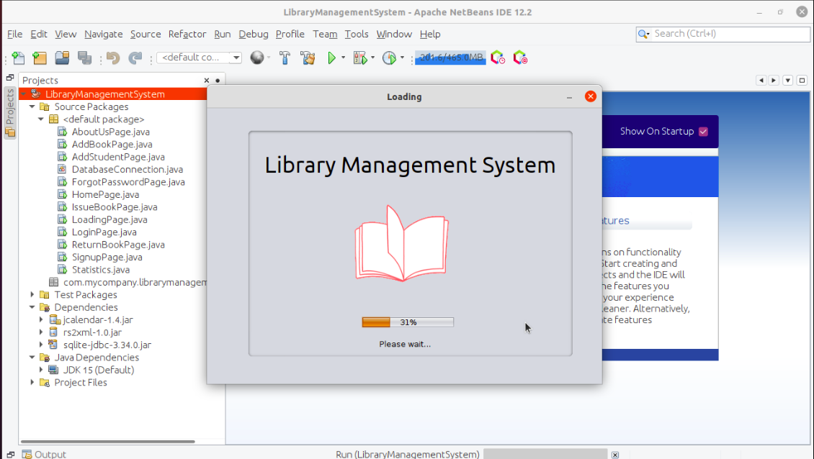
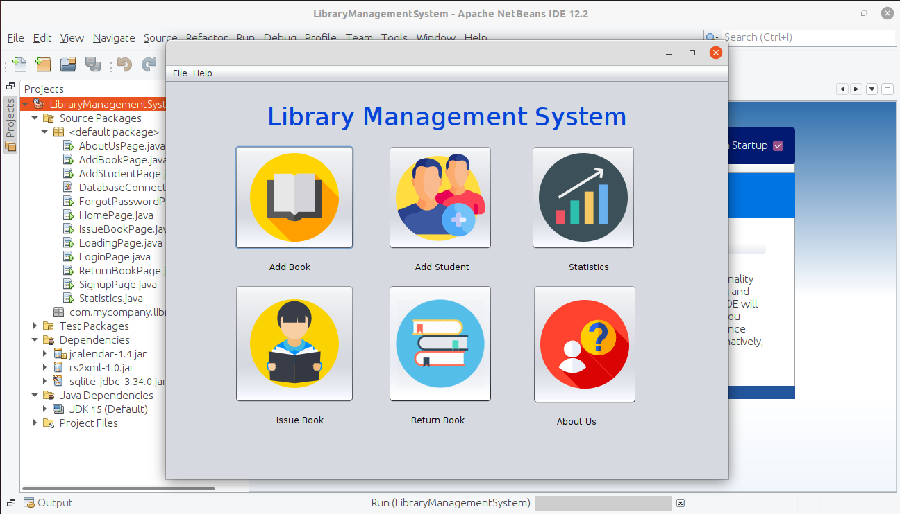

# Library Management System
### Features:
1. User Authentication
2. Password Retrieve
3. Add new books and students
4. Student can issue book
5. Return issued books
6. Statistics

### Environment
Language: Java Swing 
Database: sqlite 
IDE: Netbeans

### Snapshots:

